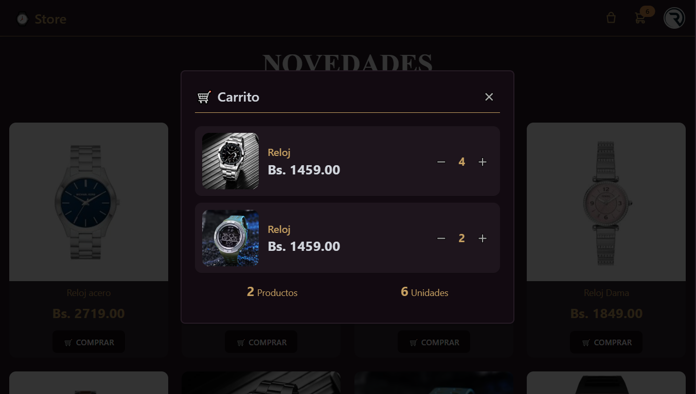

# 🛒 Carrito de Compras de Relojes — Vue 3 + Firebase

Un **carrito de compras sencillo y elegante** para relojes, desarrollado con Vue 3, Vite y Firebase. Ideal como base para proyectos de e-commerce ligeros.

---

## 📸 Vista Previa

### 🏠 Página de Inicio — "Bienvenidos a la Elegancia"


### 🕰️ Catálogo de Relojes


### 🛍️ Carrito de Compras


---

## 🚀 Demo en Vivo

🔗 [Haz clic aquí para ver el proyecto desplegado en Vercel](https://carrito-compras-eight.vercel.app)

---

## ⚙️ Tecnologías Utilizadas

- ✅ Vue 3
- ⚡ Vite
- 🛠️ Pinia (Manejo de estado)
- 🎨 TailwindCSS + DaisyUI
- 🔥 Firebase (Autenticación y almacenamiento)

---

## 🎯 Funcionalidades Clave

- 🔐 Registro e inicio de sesión con correo electrónico o Google
- 🖼️ Subida de imágenes de productos con descripción
- 🛒 Agregar productos al carrito
- 🧾 Vista del carrito con productos seleccionados
- 🧩 Arquitectura escalable para agregar pagos o comentarios (futuro)

---

## 💻 Instalación Local

```bash
git clone https://github.com/TU_USUARIO/011_cloneInstagram.git
cd 011_cloneInstagram
npm install
npm run dev
